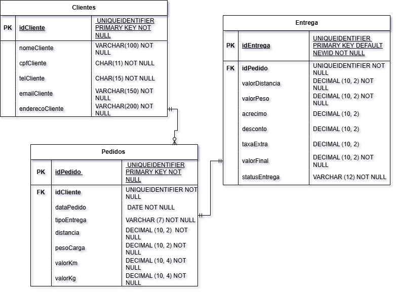

## API Reference 

### MODELO ENTIDADE RELACIONAMENTO


### Clientes

#### GET /clientes
- **Descrição** : Obtém uma lista de clientes
- **Response**:  Array de clientes
```
	{
		"idCliente": "1D4635A2-4E72-47D2-BE34-29E2021388E1",
		"nomeCliente": "livia",
		"cpfCliente": "12345542298",
		"telCliente": "055019911993713",
		"emailCliente": "livia@gmail",
		"enderecoCliente": "tititlalalalalalati"
	}
```

#### POST /clientes
- **Descrição** : Cria um novo cliente
- **Body** : 
```
    { 
				
		"nomeCliente" : "livia",
        "cpfCliente" : "12345599298",
        "telCliente": "055019911993713",
        "emailCliente" : "livia@gmail",
        "enderecoCliente" : "tititlalalalalalati"
			
			} 
```
- **Response**:
```
{
	"message": "Cliente cadastrado com sucesso!"
} 
```
- **Error Response**:
```
{
	"erro": "CPF já cadastrado!"
}

```
#### PUT /clientes
-**Descrição**: Atualiza um cliente já existente
-**Body**: 
```
{	
        "telCliente": "055019911993000"      
}
```
-**Response**:
```
{
    "message":"Cliente atualizado com sucesso!"
}
```

#### DELETE /clientes /idCliente
-**Descrição**: Deleta o cliente com base no Id
- **Response**: 
```
{
    "message":"Cliente deletado com sucesso!"
}
```

### Pedidos

#### GET /pedidos
- **Descrição** : Obtém uma lista de pedidos 
- **Response** : Array de pedidos 
´´´
[
	{
		"idPedido": "D568739A-DC02-48F5-B54B-8ECCED1C5554",
		"idCliente": "1D4635A2-4E72-47D2-BE34-29E2021388E1",
		"dataPedido": "2025-11-25T00:00:00.000Z",
		"tipoEntrega": "urgente",
		"distancia": 250,
		"pesoCarga": 5,
		"valorKm": 3.5,
		"valorKg": 4
	},
	{
		"idPedido": "1C43AEC9-A2CF-4B62-97F2-BD23AAECAB1D",
		"idCliente": "365CE11F-0784-4CF8-BAE6-6EC9680F20F2",
		"dataPedido": "2025-11-21T00:00:00.000Z",
		"tipoEntrega": "normal",
		"distancia": 150,
		"pesoCarga": 67,
		"valorKm": 2.5,
		"valorKg": 3
	}
]
´´´

#### POST /pedidos 
- **Descrição** : Cria um novo pedido
- **Body** : 
```
{
   
 {
  "idCliente": "1D4635A2-4E72-47D2-BE34-29E2021388E1",
  "dataPedido": "2025-11-31",
  "tipoEntrega": "urgente",
  "distancia": 10,
  "pesoCarga": 16,
  "valorKm": 9,
  "valorKg": 3.5
}
}
```

- **Response**:
```
{
    "message": "Pedido criado com sucesso!"    
} 
```

#### PUT /pedidos
-**Descrição**: Atualiza um pedido já existente
-**Body**: 
```
{
	"statusEntrega": "em transito"
}
```
-**Response**:
```
{
    "message":"Pedido atualizado com sucesso!"
}
```

#### DELETE /pedidos /idPedido
-**Descrição**: Deleta o pedido com base no Id
- **Response**: 
```
{
    "message":"Pedido deletado com sucesso!"
}
```

### Entregas


#### GET /entregas
- **Descrição** : Obtém uma lista de entregas
- **Response** : Array de entregas


